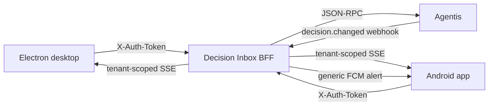

# Decision Inbox

<p align="center">
  <strong>Keep human decisions moving without living in a task log.</strong><br>
  Decision Inbox turns Agentis questions and approval requests into a focused,<br>
  real-time action queue for desktop and Android.<br><br>
  
  
  
  
</p>

Agents can move fast, but some actions still need a person. Decision Inbox adds
**Human In The Loop** oversight by collecting those moments in one place so
users can answer a question, approve a change, or reject a risky action without
searching through Agentis runs.

> [!NOTE]
> Decision Inbox is a companion for an existing Agentis deployment. It does not
> maintain a second decision database; the BFF reads and resolves decisions in
> Agentis.

## Why Decision Inbox

- **One focused queue** for pending questions and approvals, with the source
  Agentis task and run always one click away.
- **Decide from anywhere** with a tray-resident desktop app and an Android
  client using the same workflow.
- **React in real time** through tenant-scoped SSE updates, native desktop
  notifications, and generic FCM alerts.
- **Keep sensitive content private**: push notifications contain no prompts,
  answers, summaries, or comments.
- **Stay in control** with decision history, stale-state handling, and direct
  links back to the originating task and run.

## What Users Get

| Capability | Desktop | Android |
| --- | :---: | :---: |
| Pending inbox and decision history | Yes | Yes |
| Single-choice, multiple-choice, and freeform answers | Yes | Yes |
| Approve or reject with an optional comment | Yes | Yes |
| Live SSE refresh and reconnect | Yes | Yes |
| Native notifications | Yes | Yes, with FCM |
| Source task and run links | Yes | Yes |
| Read-only snapshot during an outage | Yes | Yes |
| Secure, OS-backed token storage | Electron `safeStorage` | Android Keystore |
| Tray, close-to-tray, and autostart | Yes | Not applicable |

Offline snapshots live only in process memory. Decision Inbox never queues a
resolution while offline, so an old answer cannot be submitted later by
surprise.

## How It Works



The Fastify BFF owns all Agentis network calls. It forwards the user's token
only for the current request, derives tenant and user identity from Agentis,
and stores only Android push registration metadata in SQLite. Decision content
and user tokens are never persisted by the BFF.

## Try the UI

The fastest way to explore the desktop experience is the development-only demo.
It uses safe sample decisions and does not require an Agentis account.

**Requirements:** Node.js 22 or newer and npm.

```bash
npm ci
VITE_DEMO_MODE=1 ./run-dev.sh
```

Open [http://127.0.0.1:5173](http://127.0.0.1:5173). The script also starts the
BFF at `http://127.0.0.1:8787` and writes logs to `.dev/`.

```bash
./stop-dev.sh
```

> [!IMPORTANT]
> Demo mode exists only in the development renderer. It is not included in a
> packaged Electron application.

## Connect Agentis

Set a reachable Agentis origin and restrict the webhook to the Agentis egress
network before starting local services with real data:

```bash
export AGENTIS_API_URL="https://agentis.example.com"
export AGENTIS_SESSION_RPC="auth.user_data"
export WEBHOOK_ALLOWED_IPS="203.0.113.10/32"
./run-dev.sh
```

After building, launch the desktop application against a deployed BFF:

```bash
npm run build

DECISION_BFF_URL="https://decisions.example.com" \
AGENTIS_WEB_URL="https://agentis.cz" \
npm run start --workspace @decision-inbox/desktop
```

The desktop renderer cannot contact the BFF directly. Electron keeps the token
and network operations in the main process; the sandboxed renderer can use only
the typed methods exposed by `src/preload.ts`.

### Android

The Android client requires Flutter 3.44+, Android SDK 35+, and JDK 17+.

```bash
cd apps/mobile
flutter pub get
flutter run \
  --dart-define=DECISION_BFF_URL=http://10.0.2.2:8787 \
  --dart-define=AGENTIS_WEB_URL=https://agentis.cz
```

Debug builds accept cleartext BFF traffic only for `localhost` and the Android
emulator alias `10.0.2.2`. Release builds require HTTPS. See
[`apps/mobile/README.md`](apps/mobile/README.md) for Firebase defines, release
signing, validation commands, and Android background-delivery constraints. The
Firebase Android application ID is `cz.agentis.decision_inbox`.

## Project Structure

```text
apps/
  api/          Fastify BFF, webhook, SSE, FCM, and SQLite registrations
  desktop/      Electron main process, typed preload, and React renderer
  mobile/       Flutter Android client
packages/
  contracts/    Shared Zod schemas and TypeScript types
k8s/
  api-bff.yaml  Single-replica Kubernetes deployment template
```

The TypeScript side is an npm workspace. The Android app has an independent
Flutter toolchain and validation flow.

## Configuration

### BFF

| Variable | Default | Purpose |
| --- | --- | --- |
| `BFF_HOST` | `127.0.0.1` | Listen host |
| `BFF_PORT` | `8787` | Listen port |
| `AGENTIS_API_URL` | `https://agentis.invalid` | Deliberately invalid placeholder; set this for real use |
| `AGENTIS_SESSION_RPC` | `auth.user_data` | Authenticated RPC used to derive session and tenant identity |
| `WEBHOOK_ALLOWED_IPS` | empty | Exact IP/CIDR allowlist; an empty list rejects every webhook |
| `TRUSTED_PROXY_CIDRS` | empty | Proxies allowed to supply the first `X-Forwarded-For` address |
| `BFF_CORS_ORIGINS` | disabled | Comma-separated browser origins; use `*` only for local development |
| `SQLITE_PATH` | `.data/decision-inbox.sqlite` | Android installation and push registration metadata |
| `FIREBASE_PROJECT_ID` | empty | Firebase project; an empty value disables FCM dispatch |
| `WEBHOOK_IDEMPOTENCY_TTL_MS` | `900000` | In-memory webhook deduplication window |
| `WEBHOOK_IDEMPOTENCY_MAX_ENTRIES` | `10000` | Maximum in-memory idempotency entries |

FCM uses `google-auth-library` Application Default Credentials with the
`firebase.messaging` scope. Prefer workload identity or a runtime-mounted
secret in production.

### Desktop

| Variable | Default | Purpose |
| --- | --- | --- |
| `DECISION_BFF_URL` | `https://agapprove.agentis.cz` | BFF URL used by the Electron main process |
| `AGENTIS_WEB_URL` | `https://agentis.cz` | Base URL for source task and run links |
| `ELECTRON_RENDERER_URL` | packaged renderer | Local Vite URL used during Electron development |

## BFF Contract

Protected requests carry the Agentis token in `X-Auth-Token`. The BFF never
accepts a client-supplied tenant or user identity.

| Route | Agentis operation or behavior |
| --- | --- |
| `GET /health` and `GET /v1/health` | Service health |
| `GET /v1/session` | Configured session RPC, normally `auth.user_data` |
| `GET /v1/decisions?view=pending\|history&page=1` | `decision.get_list` |
| `GET /v1/decisions/pending-count` | `decision.get_pending_count` |
| `POST /v1/decisions/resolve` | `task.question_reply` or `task.approve_reply` |
| `GET /v1/events` | Authenticated, tenant-scoped SSE stream |
| `PUT /v1/push/registration` | Upsert the authenticated Android installation |
| `DELETE /v1/push/registration/:installationId` | Remove an owned installation |
| `PUT /v1/desktop/presence` | Record or clear ephemeral desktop activity |
| `POST /v1/webhooks/agentis/decision-changed` | Validate and fan out an Agentis event |

Example question resolution:

```json
{
  "decisionKind": "question",
  "externalId": "question-123",
  "taskId": "42",
  "runId": "run-7",
  "answers": [
    {
      "questionId": "q-1",
      "optionIds": ["canary"],
      "answerText": "Start with 10% of production traffic."
    }
  ]
}
```

Agentis errors keep their status and code. In particular,
`already_resolved` and `decision_cancelled` remain `409` responses so clients
can mark a card stale and refresh instead of presenting a false success.

## Realtime Delivery

Agentis sends strict `decision.changed` webhook events to the BFF. Accepted
events refresh connected clients through SSE; new pending decisions can also
trigger Android push delivery.

- Webhooks are protected by exact IP/CIDR allowlisting and bounded in-memory
  idempotency, not HMAC. Restrict ingress to the configured Agentis network.
- `X-Forwarded-For` is ignored unless the direct proxy is included in
  `TRUSTED_PROXY_CIDRS`.
- SSE resolves tenant identity from the authenticated Agentis session and
  strips `tenant_id` from client payloads.
- Desktop presence suppresses mobile push while the same user is active.
  Heartbeats expire after 75 seconds, so an offline desktop fails open for
  mobile delivery.
- Push notifications contain only a schema version, pending-inbox route, and
  opaque event ID. The visible message is always generic.
- SSE reconnect and the 60-second pending-count poll repair missed webhook
  hints.

Set `AGAPPROVE_DECISION_WEBHOOK_URL` on the Agentis side to the public HTTPS
webhook URL. Public reachability does not mean open ingress: the webhook route
must remain restricted to Agentis egress addresses.

## Security Model

- Desktop credentials are encrypted with Electron `safeStorage`; there is no
  plaintext fallback, and the renderer never receives the token.
- Android credentials and installation state use Keystore-backed
  `flutter_secure_storage`; Android backup is disabled.
- The BFF forwards tokens to Agentis but never persists or logs them.
- SQLite contains installation ID, FCM token, authenticated tenant/user
  ownership, platform, and timestamps. It contains no decision content.
- Authenticated mobile requests reject redirects, and production clients
  require HTTPS.
- Notifications and webhook events intentionally omit decision text.

If secure OS storage is unavailable, credential persistence and notifications
fail closed.

## Development

Validate the API, desktop app, and shared contracts:

```bash
npm ci
npm test
npm run typecheck
npm run build
```

These root commands cover npm workspaces only. Validate Android separately:

```bash
cd apps/mobile
flutter pub get
dart format --output=none --set-exit-if-changed lib test
flutter analyze
flutter test
flutter build apk --debug --dart-define-from-file=firebase-defines.json
```

Automated tests cover RPC mapping, strict request contracts, authentication,
SQLite registration isolation, webhook validation and idempotency, tenant-safe
SSE fan-out, resolution UI, stale decisions, encrypted stores, and notification
baseline logic. Live FCM delivery and native OS notification smoke tests require
a configured device and environment.

## Build and Deploy

Build desktop installers after the application build succeeds:

```bash
npm run dist:linux --workspace @decision-inbox/desktop
npm run dist:windows --workspace @decision-inbox/desktop
```

Linux produces AppImage and Debian packages; Windows produces an NSIS
installer. Artifacts are written to `apps/desktop/release/`. Automatic updates
and release signing are not configured.

Build and deploy the BFF from the repository root:

```bash
docker build -f apps/api/Dockerfile \
  -t registry.example.com/agapprove-api:latest .
kubectl apply -f k8s/api-bff.yaml
```

> [!WARNING]
> `k8s/api-bff.yaml` is a deployment template, not a turnkey production
> manifest. Replace the image, host, TLS secret, CIDRs, Firebase project, and
> credential delivery before applying it. The current Dockerfile expects an
> ignored Firebase service-account file during the image build; replace that
> approach with workload identity or a runtime-mounted secret for production.

The supplied deployment intentionally runs one replica because SQLite push
registrations, SSE replay, desktop presence, and webhook idempotency are local
to one process. Horizontal scaling requires a shared registration store, event
broker, replay/idempotency store, and presence store.

## Current Limits

- Decision Inbox depends on an existing Agentis API and authenticated user
  token.
- There is no durable offline queue; cached pages are read-only.
- Webhook delivery is a refresh hint rather than a transactional outbox.
- Android force-stop blocks FCM until the user opens the app again.
- Live FCM, OS notifications, reverse-proxy behavior, and production Agentis
  integration require environment-specific smoke testing.
